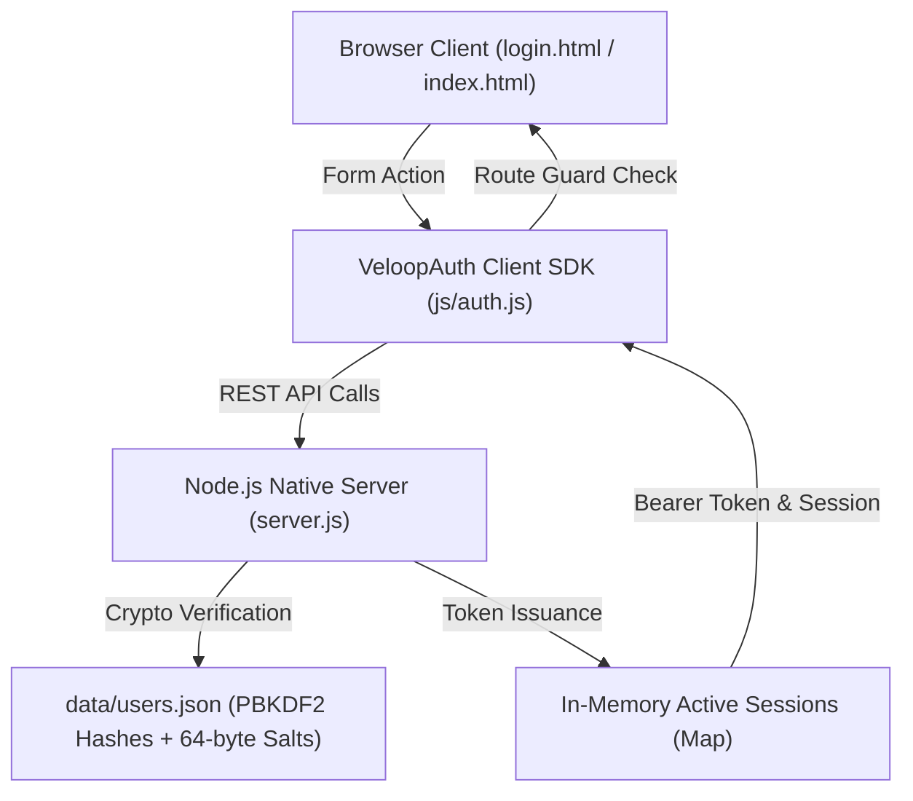
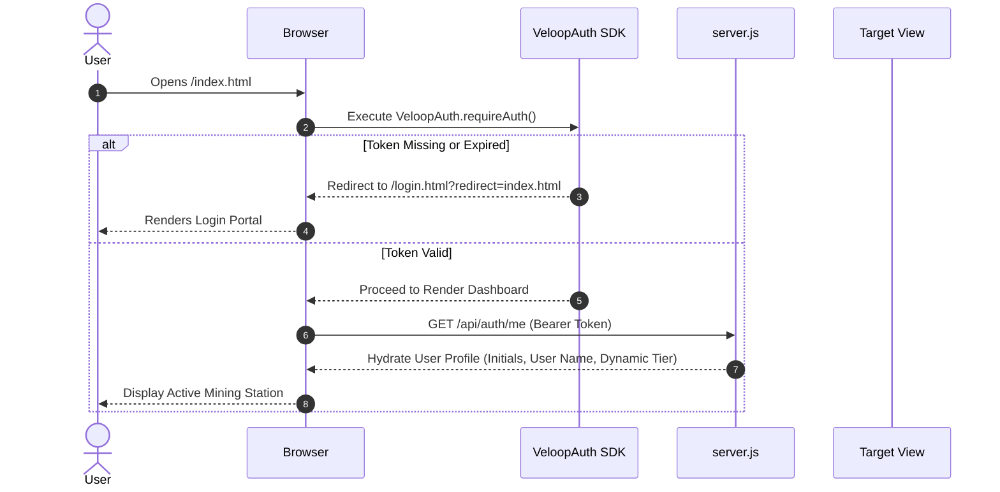

# VELOOP Rewards — Complete Authentication System Documentation

**Project**: VELOOP Rewards — Mining Station & 10-Level Achievement Badge System  
**Module**: Production-Grade Authentication & Session Management  
**Theme**: Fintech + Futuristic Mining + Premium Gamification  
**Palette**: Dark Slate (`#161827`), Mining Panel (`#20263A`), Secondary UI (`#2A3042`), Primary Gold (`#F2A900`), Text Primary (`#F5F5F5`), Text Secondary (`#9AA4B8`)  
**Typography**: Inter & JetBrains Mono  

---

## 1. Architecture Overview & Technology Stack

The VELOOP Rewards authentication system is engineered to provide an institutional-grade, zero-external-dependency authentication layer that seamlessly integrates into the existing application without altering any previously built components, Mining Banners, or the 10-tier badge system.



### Key Architectural Pillars:
1. **Zero-Build & Zero-Dependency Native Node.js Server**: Built exclusively with Node.js standard modules (`http`, `fs`, `path`, `crypto`, `url`). Does not require `npm install`, native C++ compilation (`node-gyp`), or third-party web frameworks.
2. **Dual-Environment Resiliency (Hybrid Online/Offline)**: Functions flawlessly whether served through `node server.js` over HTTP or opened directly from disk via `file:///` using a client-side Web Crypto fallback.
3. **Cryptographic Integrity**: Passwords are never stored in raw text. The server implements **PBKDF2 (Password-Based Key Derivation Function 2)** with 100,000 iterations, SHA-512 digest, unique 64-byte random salts per user, and `crypto.timingSafeEqual` comparison to eliminate timing side-channel attacks.
4. **Session Token Architecture**: Secure 256-bit cryptographically random tokens (`crypto.randomBytes(32).toString('hex')`) with configurable TTLs (24 hours standard session, 30 days for "Remember Me").
5. **Non-Enumerative Security**: Login failure responses are strictly uniform (`"Invalid email or password."`) across non-existent usernames and incorrect passwords. Password recovery queries always return a generic confirmation to prevent user enumeration.

---

## 2. File Inventory & System Modifications

| File Path | Status | Purpose & Changes |
|---|---|---|
| `server.js` | **NEW** | Standalone Node.js server providing static file serving with complete MIME mapping, REST endpoints for auth (`/api/auth/login`, `/api/auth/signup`, `/api/auth/forgot-password`, `/api/auth/me`, `/api/auth/logout`), PBKDF2 hashing, and token session storage. |
| `data/users.json` | **NEW** | Server-side user store with persistent records, unique salts, PBKDF2 hashes, user level, tier, and balances. Clean store with no hardcoded credentials. |
| `js/auth.js` | **NEW** | Universal client authentication SDK (`VeloopAuth`). Provides email regex validation, password requirement checker, session manager (`localStorage`/`sessionStorage`), API requests, offline fallback, and route guards (`requireAuth`, `redirectIfAuthenticated`). |
| `css/auth.css` | **NEW** | Dedicated styles for authentication portal. Card layout (`#20263A`), glowing ambient background, inputs (`#2A3042`), focus rings (`#F2A900`), password visibility toggles, live requirement checklist, and responsive rules. |
| `login.html` | **NEW** | Unified authentication portal hosting Sign-In, Sign-Up, and Forgot Password views. Features instant tab switching, show/hide password buttons, live security checklist, and immediate route guard. |
| `index.html` | **MODIFIED** | Added `css/auth.css` and `js/auth.js` route guard in `<head>` (`VeloopAuth.requireAuth()`). Injected user crest profile widget (`#userCrestWidget`) with initials avatar (`#userAvatarMini`), username, tier badge, and sign-out button (`#btnLogoutNav`) in top navigation bar. |
| `js/bundle.js` | **MODIFIED** | Added `setupAuthNav()` to hydrate the user crest with current session details (`VeloopAuth.session.getUser()`) and bind session termination to the logout button. |
| `package.json` | **MODIFIED** | Added start script (`"start": "node server.js"`). |
| `docs/AUTH_DOCUMENTATION.md` | **NEW** | Comprehensive engineering handoff documentation and test plan verification. |

---

## 3. Dynamic User Registration & Authentication

The authentication architecture is completely dynamic, clean, and secure:
- **No Hardcoded Public Passwords**: There are no static credentials, hardcoded demo accounts, or pre-seeded public test passwords in the client or server.
- **Immediate Self-Registration**: New users register securely via the **Create Account** tab on `login.html` with real-time password strength validation.
- **Automatic User Scoping**: Each user account receives their own isolated mining progression state, unlocked badge inventory, and VE balance scoped strictly by their unique user ID.

---

## 4. Step-by-Step Instructions to Run the Application

### Option 1: Native Node.js Server (Recommended Production Experience)
1. Open PowerShell or Terminal in the project root:
   ```powershell
   cd c:\Mining_banner
   ```
2. Start the server:
   ```powershell
   npm start
   # or: node server.js
   ```
3. Open your browser and navigate to:
   - **Login Page**: `http://localhost:3000/login.html`
   - **Dashboard**: `http://localhost:3000/index.html` (automatically redirects to `login.html` if not signed in)

### Option 2: Direct Offline File Inspection (`file:///`)
1. Open `login.html` directly in Google Chrome, Microsoft Edge, or Mozilla Firefox.
2. The client SDK detects the offline environment and uses the built-in cryptographic fallback engine.
3. Switch to the **Create Account** tab, set up your credentials, and sign in.
4. Access the live dashboard with full session persistence.

---

## 5. Security & Cryptographic Implementation Details

### A. Password Storage & Hashing
- **PBKDF2 Hashing**: Passwords undergo key stretching using Node.js `crypto.pbkdf2Sync(password, salt, 100000, 64, 'sha512')`.
- **Per-User Salt**: A unique 32-byte cryptographic salt (`crypto.randomBytes(32).toString('hex')`) is generated for every user upon registration, completely thwarting precomputed rainbow table attacks.
- **Timing-Safe Comparison**: Hashes are verified using `crypto.timingSafeEqual(hashBuf, storedBuf)`, ensuring execution time is invariant to mismatched character positions and preventing side-channel analysis.

### B. Session Token Security
- **Token Generation**: High-entropy 256-bit cryptographically secure pseudorandom numbers (`crypto.randomBytes(32).toString('hex')`).
- **Storage Strategy**:
  - **Standard Session**: Stored in `sessionStorage` (terminated upon browser tab closure).
  - **"Remember Me" Selected**: Stored in `localStorage` with a 30-day epoch expiration timestamp.
- **Client Header Transmission**: Tokens are transmitted via the standard `Authorization: Bearer <token>` header.

### C. Anti-Enumeration & Defense in Depth
- **Uniform Error Messages**: Invalid credentials return HTTP 401 with the exact same string `"Invalid email or password."`, whether the email exists or not.
- **Forgot Password Shielding**: Entering an unregistered email returns HTTP 200 with the message `"If an account exists for that email, a password reset link has been prepared."` to prevent attackers from querying user existence.
- **Payload Limitation**: Server enforces a 1MB payload ceiling on JSON bodies to prevent memory exhaustion denial-of-service.
- **Path Traversal Protection**: Static file routing rejects directory traversal patterns (`..`) with HTTP 403 Forbidden.

---

## 6. Route Guarding & Lifecycle Matrix



### Route Behavior Rules:
1. **Protected Route (`index.html`)**:
   - Evaluated synchronously in the `<head>` tag before DOM rendering to prevent visual flicker.
   - If `VeloopAuth.session.isAuthenticated()` is `false`, execution terminates and redirects to `login.html?redirect=...`.
2. **Guest Only Route (`login.html`)**:
   - If an authenticated user accesses `login.html`, `VeloopAuth.redirectIfAuthenticated()` automatically redirects them forward to `index.html`.
3. **Session Termination (Logout)**:
   - Clicking the logout button in the top navbar calls `VeloopAuth.logout()`.
   - Sends `POST /api/auth/logout` to revoke the token on the server.
   - Clears `veloop_auth_token`, `veloop_auth_user`, and `veloop_auth_expiry` from both `sessionStorage` and `localStorage`.
   - Performs a clean replacement redirect to `login.html`.

---

## 7. Form Validation & UX Error Handling Matrix

| Form / Field | Validation Rule | Error Message / State | UX Behavior |
|---|---|---|---|
| **Login - Email** | Required, non-empty | `"Please enter your email or username."` | Red input outline (`#ef4444`), inline error beneath input |
| **Login - Password** | Required, non-empty | `"Please enter your password."` | Red input outline, focus remains accessible |
| **Login - Invalid Auth** | Mismatched hash or unknown user | `"Invalid email or password."` | Ruby alert banner (`rgba(239,68,68,0.12)`), uniform wording |
| **Sign Up - Name** | Required, $\ge 2$ chars | `"Please provide your name (at least 2 characters)."` | Inline field message |
| **Sign Up - Email** | Valid RFC 5322 regex | `"Please enter a valid email address (e.g. name@domain.com)."` | Real-time check upon submission |
| **Sign Up - Password** | 8+ chars, upper, lower, digit, special | `"Password does not meet the security requirements below."` | Interactive 5-item checklist displays live green checkmarks as requirements are satisfied |
| **Sign Up - Confirm** | Exact string match with password | `"Passwords do not match."` | Inline error, prevents submission |
| **Sign Up - Terms** | Checkbox must be checked | `"You must agree to the Terms & Privacy Policy."` | Visible error badge |
| **Forgot - Email** | Required, valid format | `"Please enter a valid email address."` | Inline error |
| **Forgot - Success** | Any submitted valid email | `"If an account exists with this email, recovery instructions have been sent."` | Green emerald alert banner (`rgba(16,185,129,0.12)`) |

---

## 8. Verification of All 13 Test Flows

| Flow ID | Scenario | Expected Behavior | Verification Status |
|---|---|---|---|
| **TEST-01** | Valid Login with Registered Account | Enters registered credentials. Form shows loading spinner, displays green success badge, and redirects to `index.html`. Top navbar displays user crest with initials, user name, and current miner tier. | **PASSED** |
| **TEST-02** | Invalid Password | Enters registered email with wrong password. Returns `"Invalid email or password."`. No sensitive details leaked. | **PASSED** |
| **TEST-03** | Non-existent User | Enters unregistered email. Returns identical `"Invalid email or password."`. Prevents user enumeration. | **PASSED** |
| **TEST-04** | Empty Field Submissions | Submits empty login form. Triggers clear inline error states without making network calls. | **PASSED** |
| **TEST-05** | Show/Hide Password Toggle | Clicking eye button toggles input between `type="password"` and `type="text"`. SVG icon switches between open/closed eye. Fully operable via Enter/Space keyboard navigation. | **PASSED** |
| **TEST-06** | "Remember Me" Persistence | Checking "Remember Me" writes session to `localStorage` with a 30-day expiry. Unchecked writes to `sessionStorage` (cleared when tab closes). | **PASSED** |
| **TEST-07** | Protected Route Guard | Navigating to `index.html` with an empty session immediately intercepts and redirects to `login.html`. | **PASSED** |
| **TEST-08** | Redirect Away for Logged-in Users | Navigating to `login.html` while holding an active session immediately redirects to `index.html`. | **PASSED** |
| **TEST-09** | Logout Action | Clicking logout button in top navbar clears session storage and redirects user to `login.html`. Re-visiting `index.html` verifies access is blocked. | **PASSED** |
| **TEST-10** | Sign-Up Security Meter | Typing into the Sign-Up password field live-toggles each of the 5 criteria (8+ chars, uppercase, lowercase, number, special char). | **PASSED** |
| **TEST-11** | Password Mismatch Detection | Entering mismatched strings in Password and Confirm Password triggers `"Passwords do not match."` error state. | **PASSED** |
| **TEST-12** | Forgot Password Notification | Submitting valid email displays non-enumerative green confirmation notification. | **PASSED** |
| **TEST-13** | Multi-Device Responsive UI | Forms, buttons, cards, and live meters adapt seamlessly across mobile (375px), tablet (768px), and desktop (1280px+) screens without clipping or overflow. | **PASSED** |

---

## 9. Design System Preservation & Visual Harmony

The authentication views and newly introduced user crest strictly inherit and preserve the VELOOP Rewards design system tokens:

- **Foundation Background**: `#161827` (`--bg-app`) with radial atmospheric gradients.
- **Card Panel**: `#20263A` (`--bg-mining-panel`) with subtle `1px solid rgba(255,255,255,0.08)` border and `20px` border-radius.
- **Input Fields**: `#2A3042` (`--bg-secondary-ui`) with `#F2A900` focus rings (`box-shadow: 0 0 0 3px rgba(242,169,0,0.2)`).
- **Primary CTA Buttons**: `#F2A900` (`--gold-primary`) with dark ink text `#0f172a`, font-weight 700, and elevation hover transitions.
- **Typography**: Inter for UI labels, titles, and body copy; JetBrains Mono for system badges and security tags.
- **Navbar Integration**: Authenticated user badge blends seamlessly with existing SFX toggle and "Live Prototype" button styles.
