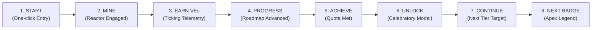

# Section 08 — Badge Progression & User Journey Specification

**Figma Page**: `03 Mining Banner` (Section `08 — Badge Progression & Roadmap`)  
**Scope**: 10-node connected milestone progression timeline, goal-gradient pacing mechanics, and the end-to-end 8-step user journey.

---

## 1. The 10-Node Horizontal Progression Track

```
Frame: "Progression Track Container" (W: 1280px, H: 420px, Fill: #20263A, Radius: 24px, Padding: 40px)
│
├── Frame: "Active Journey Header Bar" (Auto Layout Horizontal, Align: Space-Between)
│   ├── Frame: "Current Status Group"
│   │   ├── Tag: "ACTIVE JOURNEY" (Fill: rgba(242,169,0,0.12), Text: #F2A900)
│   │   ├── Text: "Level 3 of 10" (Inter ExtraBold 26px, Fill: #FFFFFF)
│   │   └── Text: "Current Standing: Gold Miner (Reward Hunter)" (Inter Medium 14px, Fill: #F2A900)
│   └── Frame: "Next Frontier Callout Box" (Padding: [12px, 20px], Fill: #161827, Radius: 12px, Border: 1px #38bdf8)
│       ├── Text: "NEXT ACHIEVEMENT" (JetBrains Mono Bold 10px, Fill: #9AA4B8)
│       └── Text: "Level 04 — Platinum: Elite Earner" (Inter Bold 15px, Fill: #38bdf8)
│
├── Frame: "Segmented Goal-Gradient Bar" (W: Fill, Margin: [24px, 0])
│   ├── Frame: "Progress Labels" (Align: Space-Between)
│   │   ├── Text: "Current Progress: 30% (3 of 10 Tiers Unlocked)" (JetBrains Mono Bold 11px, Fill: #F5F5F5)
│   │   └── Text: "7 achievements remaining to reach Legend" (JetBrains Mono Regular 11px, Fill: #9AA4B8)
│   └── Frame: "Track" (W: Fill, H: 12px, Radius: 6px, Fill: #161827)
│       └── Frame: "Fill" (W: 30%, H: 12px, Radius: 6px, Fill: Linear-Gradient(#bf7d4e 0%, #cbd5e1 50%, #F2A900 100%))
│
├── Frame: "10-Node Connected Line Track" (W: Fill, H: 120px, Auto Layout Horizontal, Align: Space-Between, Position: Relative)
│   ├── Line: "Track Base Line" (W: 100%, H: 4px, Fill: #2A3042, Position: Absolute, Y: 40px)
│   ├── Line: "Track Progress Line" (W: 30%, H: 4px, Fill: #F2A900, Position: Absolute, Y: 40px)
│   │
│   ├── Node 01: Bronze (State: Completed / Unlocked) -> Icon: 01-bronze-first-step.svg, Border: #bf7d4e, Badge: "✓"
│   ├── Node 02: Silver (State: Completed / Unlocked) -> Icon: 02-silver-rising-star.svg, Border: #cbd5e1, Badge: "✓"
│   ├── Node 03: Gold (State: Completed / Unlocked) -> Icon: 03-gold-reward-hunter.svg, Border: #F2A900, Badge: "✓"
│   ├── Node 04: Platinum (State: Active / Next Target) -> Icon: 04-platinum.svg, Border: 2px pulsing #38bdf8
│   ├── Node 05: Diamond (State: Locked) -> Icon: 05-diamond.svg, Saturation: 20%, Padlock: 🔒
│   ├── Node 06: Emerald (State: Locked) -> Icon: 06-emerald.svg, Saturation: 20%, Padlock: 🔒
│   ├── Node 07: Sapphire (State: Locked) -> Icon: 07-sapphire.svg, Saturation: 20%, Padlock: 🔒
│   ├── Node 08: Ruby (State: Locked) -> Icon: 08-ruby.svg, Saturation: 20%, Padlock: 🔒
│   ├── Node 09: Master (State: Locked) -> Icon: 09-master.svg, Saturation: 20%, Padlock: 🔒
│   └── Node 10: Legend (State: Locked Apex) -> Icon: 10-legend.svg, Saturation: 20%, Padlock: 🔒
│
└── Frame: "Next Milestone Anticipation Card" (Auto Layout Horizontal, Fill: rgba(56,189,248,0.06), Border: 1px rgba(56,189,248,0.25), Radius: 16px, Padding: [16px, 24px], Align: Space-Between)
    ├── Frame: "Left Group" (Auto Layout Horizontal, Gap: 16px, Align: Center)
    │   ├── SVG: "04-platinum-elite-earner.svg" (W: 48px, H: 48px)
    │   └── Frame: "Copy"
    │       ├── Text: "Next Frontier: Level 04 Platinum (Elite Earner)" (Inter Bold 14px, Fill: #FFFFFF)
    │       └── Text: "Earn 1,500 VEs through active mining sessions (Progress: 540 / 1,500 VEs • 36%)." (Inter Regular 12px, Fill: #9AA4B8)
    └── Button: "Start Mining to Advance →" (Fill: #38bdf8, Text: #0f172a, Font-weight: 700)
```

---

## 2. End-to-End 8-Step User Progression Journey



1. **START**: User enters the station with clear status feedback (`● STANDBY`).
2. **MINE**: Clicking `MINE NOW ⚡` engages the quantum confinement reactor.
3. **EARN VEs**: Live telemetry accumulates platform utility tokens in real time (+10, +25, +38 VE).
4. **PROGRESS**: Segmented progress bar moves closer to the next achievement threshold.
5. **ACHIEVE**: User completes session extraction quota (`● QUOTA ACHIEVED`).
6. **UNLOCK**: Celebratory modal triggers with 100% transparent vector medallion, audio chime, and confetti.
7. **CONTINUE**: Status updates to `CONTINUE MINING ⚡`, targeting the next sequential badge.
8. **NEXT BADGE**: User pursues higher prestige through the 10-tier heraldic hierarchy.
